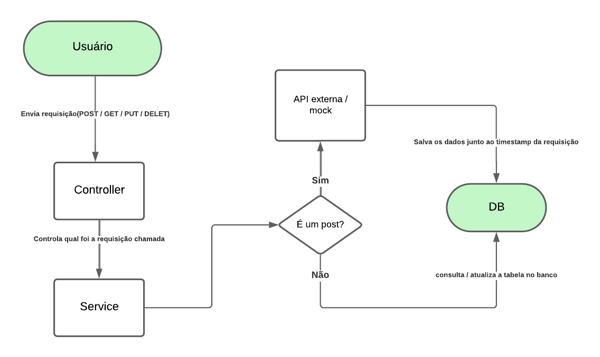

# Consulta CEP - Projeto Java Spring Boot

## Descrição

Este projeto é uma aplicação que permite consultar CEPs utilizando uma API externa (ViaCEP) ou um mock local, e registra o histórico dessas consultas em um banco de dados PostgreSQL.\
O objetivo é demonstrar boas práticas de desenvolvimento, uso de Spring Boot, JPA, validação de dados, mocks e persistência.

---

## Funcionalidades

- Consultar CEPs via API externa ou mock local (WireMock).
- Salvar histórico de consultas com timestamp no banco de dados.
- Listar, atualizar e remover consultas do histórico.
- Validações de dados (formato de CEP).
- Possibilidade de rodar o banco de dados via Docker para facilitar testes.

---

## Tecnologias Utilizadas

- Java 11+
- Spring Boot 3.5
- PostgreSQL 15
- JPA/Hibernate
- WireMock (mock da API ViaCEP)
- Docker (para PostgreSQL)

---

## Pré-requisitos

- Java 11 ou superior instalado.
- Maven instalado.
- Docker (opcional, mas recomendado para PostgreSQL e facilidade de testes).

---

## Configuração do Banco de Dados

O projeto utiliza PostgreSQL. Você pode usar o Docker com o seguinte `docker-compose.yml`:

```yaml
services:
  postgres:
    image: postgres:15
    container_name: postgres-cep
    restart: always
    environment:
      POSTGRES_USER: admin
      POSTGRES_PASSWORD: admin
      POSTGRES_DB: cepdb
    ports:
      - "5432:5432"
    volumes:
      - ./postgres-data:/var/lib/postgresql/data
```

- Usuário: `admin`
- Senha: `admin`
- Banco: `cepdb`

Após subir o container, o banco estará disponível em `localhost:5432`.

---

## Configuração da API ViaCEP

No arquivo `application.properties`, você pode alternar entre a API real ou o mock:

```properties
# API real
viacep.url=https://viacep.com.br/ws/%s/json/

# Mock local
# viacep.url=http://localhost:8089/ws/%s/json/
```

- **WireMock**: será iniciado automaticamente pelo Spring Boot ao subir a aplicação, se estiver usando a URL mock.

---

## Rodando a Aplicação

1. Inicie o PostgreSQL (Docker ou local).
2. Configure a URL da API (real ou mock) em `application.properties`.
3. Execute a aplicação:

```bash
mvn spring-boot:run
```

ou rode a classe `ConsultaCepApplication.java` no seu IDE.

4. A API estará disponível em:

```
GET/POST/PUT/DELETE: http://localhost:8080/historico
```

---

## Estrutura dos Endpoints

| Método | Endpoint        | Descrição                                    |
| ------ | --------------- | -------------------------------------------- |
| POST   | /historico      | Cria uma consulta (com validação do CEP)     |
| GET    | /historico      | Lista todas as consultas ordenadas pela data |
| PUT    | /historico      | Atualiza uma consulta existente              |
| DELETE | /historico/{id} | Remove uma consulta pelo ID                  |

---

## Validações

- O campo `cep` deve seguir o formato `00000-000`.
- Outras informações do CEP são populadas via API/mock.

---

## Fluxo da Aplicação

A imagem abaixo representa o fluxo da aplicação e do mock.




---

## Observações

- Para testes offline, utilize a URL do mock (`http://localhost:8089/ws/%s/json/`).
- A aplicação registra automaticamente o horário da consulta no banco.
- Docker é opcional, mas facilita a execução em qualquer máquina.

---

